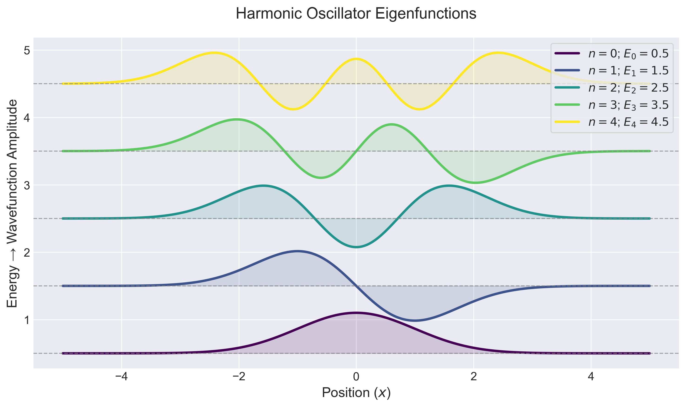

# 1D Schrödinger Equation Solver

A Python library for solving the 1D Schrödinger equation using the **Numerov method**. This package provides tools to compute wavefunctions and energy eigenvalues for arbitrary potentials, specifically tested for the Harmonic Oscillator and the radial equation of the Hydrogen Atom.

## Features

- **Numerov Integration**: Solve the 1D Schrödinger equation for any potential.
- **Wavefunction Visualization**: Plot wavefunctions and probability densities.

### Example Results

#### Harmonic Oscillator Eigenfunctions (First 5 States)


**Note:** Wavefunctions are vertically offset by their energy eigenvalues ($E_n = n+ \frac{1}{2}$).

## Installation

### Prerequisites

- Python 3.8 or higher
- `numpy`, `scipy`, and `matplotlib` 

  
### Generate Example Plots

Run examples/harmonic_oscillator.py

``` bash
python3 run_example.py
```
